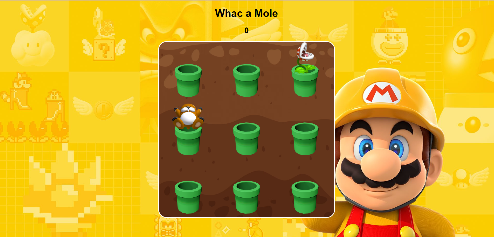

# Whac-a-mole Game 🌟🍄

Welcome to the **Mario-Themed Whac-a-Mole Game**! This is a fun twist on the classic Whac-a-Mole, inspired by the world of Mario! 👾💥 

Beware of the **Piranha Plant** 🌱—if you hit it, the game ends! Test your reflexes, avoid the dangerous plants, and see how high you can score! 🌟

## 🎮 Gameplay

1. **Moles Pop Up** 🐹: Moles appear randomly from different holes.
2. **Whack the Moles** 🪓: Score points by clicking the moles as fast as you can.
3. **Avoid the Piranha Plant** 🌱: If you accidentally hit the Piranha Plant, the game is over! ⚠️

## 🔥 Features

- **Mario Theme** 🍄🎩: Enjoy a vibrant, Mario-inspired theme for extra nostalgia!
- **Randomized Appearances** 💫: The moles (and Piranha Plants!) pop up in different holes each time.
- **Score Tracking** 📊: Keep track of your score as you whack the moles and avoid plants.

## 🚀 How to Play

1. Clone this repository to your local machine:
   ```bash
   git clone https://github.com/PremanshKhandare/Whac-a-mole-Game.git
   ```
   
2. Open the project in VS Code and run `index.html` in a browser.

3. Whack the moles 🐹 to score points—but watch out for the Piranha Plant 🌱! Hitting it will end the game immediately. Good luck! 🍀

## 📷 Screenshot


## 🛠️ Technologies Used

- **HTML** 📝
- **CSS** 🎨
- **JavaScript** ⚙️

---

Enjoy your adventure, and may you avoid the Piranha Plant! 🍄
